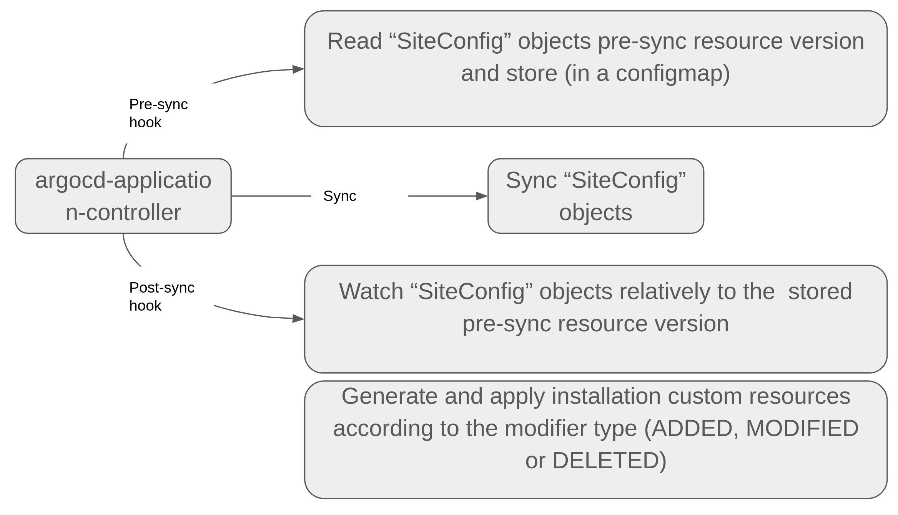
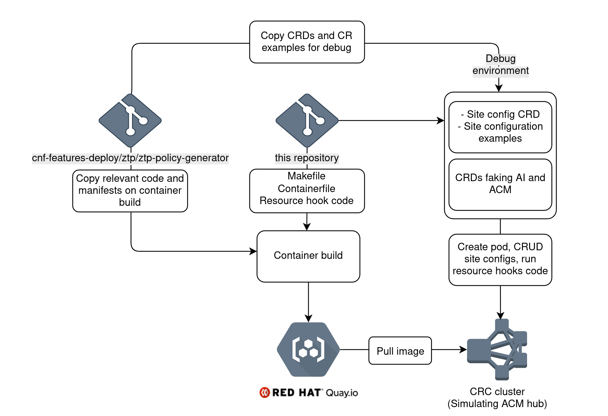

# README #

This project provides the container definitions RAN site gitops project.

## What is this repository for? ##
### Quick summary ###

The basic idea is to accept RAN site manifests in a format defined by "siteconfig" CRD, convert them to custom resources accepted by the assisted service and ACM, and apply them to the cluster running Assisted installer operator and ACM hub. 

The pipeline would look like that:
1. ArgoCD monitors site-plan repo for new site-plan data. The site plan data is expressed as a custom resource.
2. Upon site plan change / push, ArgoCD synchronizes the site-plan data to the cluster. ArgoCD pre-sync and post-sync resource hooks are used to isolate the site configuration changes, convert them to changes in Assisted installer and ACM resources and apply to the cluster.
The flow is shown below:



This repository contains the container definitions for both pre-sync and post-sync jobs.
This location, structure and project organization is temporary and intended for debug and POC. The build procedure is likely to change when integrated to the Zero Touch Provisioning pipeline.

## How do I get set up? ##
### Prerequisites ###
1. You need an Openshift cluster to actually test it. I am using [CRC](https://developers.redhat.com/products/codeready-containers/overview)
1. You need [quay.io](quay.io) credentials and belong to [Red Hat employees organization in quay](https://quay.io/organization/redhat_emp1) to push your cahnges. But you can always fork this repo and push to your private account or another registry if desired.
1. podman installed
1. make installed

### Debug flow ###
Debug includes following:
1. Build the container and push to quay. This includes copying cnf-features-deploy from a private branch that can be set in the [Makefile](./Makefile) using `REPO_ZIP_LINK` and `REPO_ZIP_NAME`
1. Run the pod
1. Create site configuration CRDs
1. Create ACM and Assisted installer CRDs to emulate fully installed cluster
1. Play with site configuration (CRUD) and see what happens

There are several Makefile targets that help with all this.



Type 
```bash
make help
```
to see the targets:

```bash
Usage:
  make <target>

General
  help             Display this help.

Build steps
  get_ztp          Download ZTP zip drom github
  build_image      Build docker image.
  push_image       Push to Quay.io.
  clean            Remove the cnf-features-deploy zip and clean site CRDs and site examples

Make and push
  prod             Make and push production build.

Cluster configuration deployment
  deploy           Deploy RBAC manifests and RAN Site CRD.
  undeploy         Undeploy RBAC manifests and RAN Site CRD.

Debug
  hack-crd         Applies assisted installer, metal3 and hive CRDs. For debug when not having AI and Hive installed on your cluster.
  unhack-crd       Removes assisted installer, metal3 and hive CRDs. For debug when not having AI and Hive installed on your cluster.
  run              Run the debug pod.
  kill             Kill the debug pod.
  repeat           Kill running pod, build, re-run the pod and get a shell to the pod
  shell            Open a shell into the running pod

```
