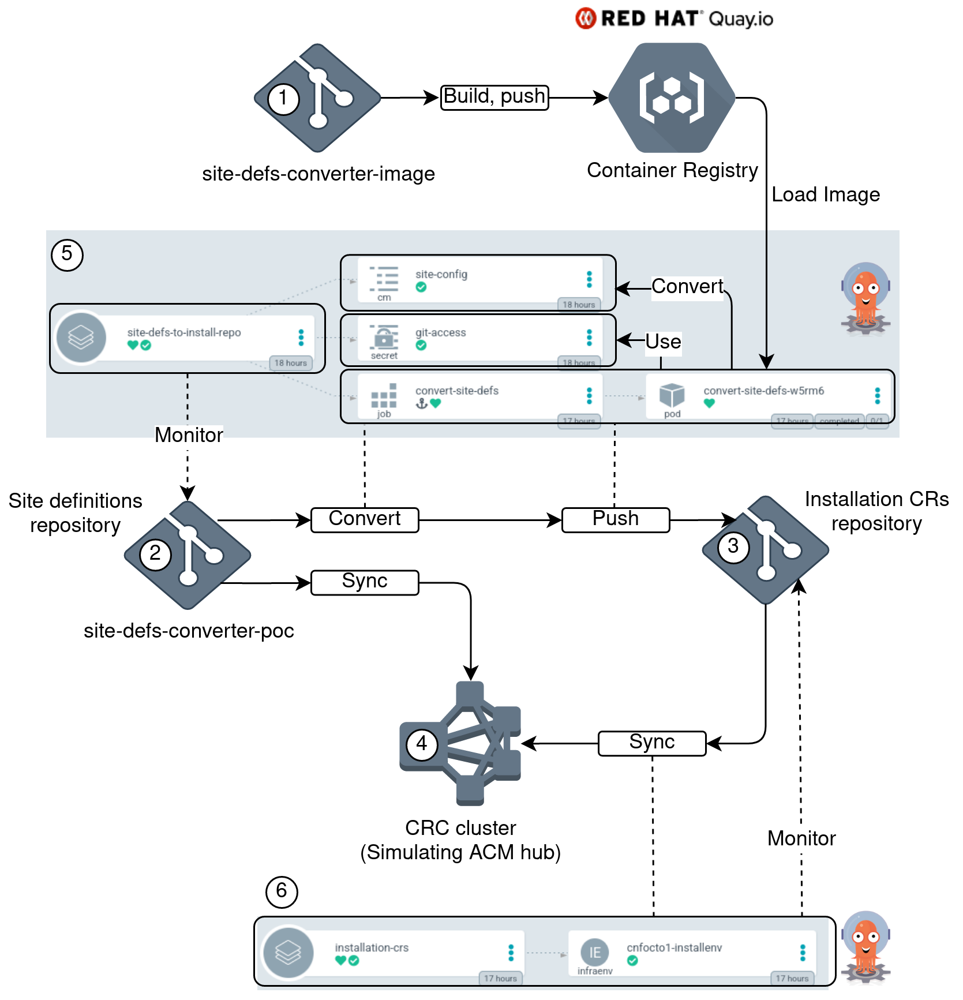
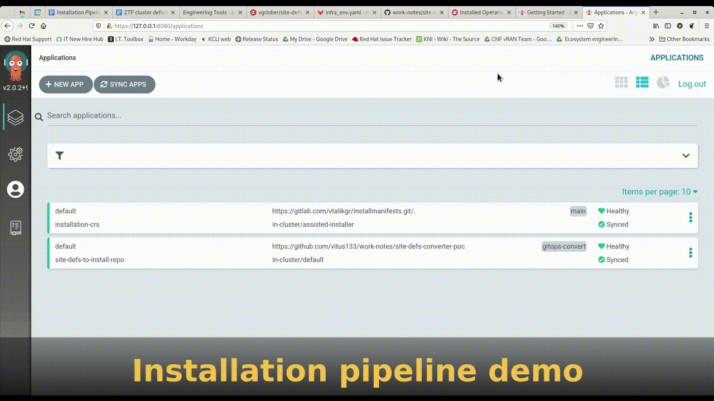

# Site definitions converter POC #
This POC demonstrates how can we create OCP installation pipeline with ArgoCD.
The basic requirement is to accept site manifests in other form that custom resources accepted by the assisted service, and convert them on the way. 

The pipeline would look like that:
1. ArgoCD monitors site-plan repo for new site-plan data. The site plan data is expressed as a config map.
2. Upon site plan change / push, ArgoCD converts site-plan data to installation CRs (using resource-hook), pushing them into installation CR git repo.
3. Another ArgoCD application monitors the installation CR repo and applies/syncs CRs to the ACM hub cluster running the assisted installer operator, that actually installs the cluster.

The pipeline prototype done on Openshift CRC is shown below:

1. This is a git repository containing the container definitions for the resource hook job. The sources for this demo are here:
https://github.com/vitus133/site-defs-converter-image

    The container image build is triggered by Quay when this repository is updated. 
2. Site definitions repository - this repository. Site definitions are stored as a config map in [site-settings/site-config.yaml](site-settings/site-config.yaml). For this demo I only used a small set of parameters needed to create the [InfraEnv](https://github.com/openshift/assisted-service/blob/209338620142cdbc36b42e0910990b36f77c16bc/config/crd/resources.yaml#L863) assisted installer resource.
3. Installation CRs git repository - a place where assisted service custom resources will be stored
4. Cluster emulating the [Advanced cluster management](https://www.redhat.com/en/technologies/management/advanced-cluster-management) hub. In the real world scenario this is the cluster that will be running the assisted installer operator. Since I am doing this POC on [CRC](https://developers.redhat.com/products/codeready-containers/overview), I had to make this cluster accept the `InfraEnv` CR, so I created a CRD for that (in [crd/crd.yaml](crd/crd.yaml)) and applied it to the cluster. Except for validating my installation CRs schema it doesn't do anything.

    The cluster is also running [ArgoCD](https://argoproj.github.io/argo-cd/getting_started/) - the engine behind the POC. 
1. This is the ArgoCD application that monitors site definitions repository. ArgoCD is using Kustomize, which means the manifests defining the sites must be a valid K8 resources and they must be defined in [kustomization.yaml](kustomization.yaml). If there is any change done to the manifests defined in our Kustomization, the application will synchronize the resources to the cluster application monitors. In our case it is the same cluster.
    
    There are two resources we synchronize in this POC: 
    1. The config map of site definitions
    1. The post-sync job definitions. The post-sync job is the cool feature of ArgoCD, that allows running Kubernetes jobs before, after, during or instead the resource sync. 
    
    Our job here will pull the container defined in (1) from Quay.io and run it after the config map is synchronized to the cluster. The job will convert the config map definitions to assisted installer CRs and push them to the installation CRs repository (3) 
1.  This is the second ArgoCD application, whose job is simple - synchronize the installation CRs to the ACM hub cluster (4)

The demo:

## Why it is useful
1. It's hard to install clusters in the `Zero Touch Provisioning` fashion. There are many parameters and moving parts. At the end we want to define a simpler API for RAN customers, hiding some of the complexity behind the scenes. Reducing the number of configuration parameters and auto-generating some others can help...
1. Many customers are not Kubernetes-native today, having their infrastructure managed in ini files, YANG XMLs, MS Excel etc. Having a way to consume different configuration formats, convert them on the fly and make a GitOps pipeline from existing definitions could be a nice feature for some. A ConfigMap can be created from any file.

## Caveats
### Site definitions format
I used a ConfigMap resource to convey site definitions. This could be a problem in some cases, since the content is not validated before the conversion hook runs.
This can be fixed by implementing a pre-sync hook that will validate the configuration before synchronizing it. It means this hook will clone the site configuration directly from Git, as opposed to mounting the config map as a volume.
### Secrets
To pull and push from Git and / or apply manifests directly to the cluster, a the container running in ArgoCD hook must authenticate to Git / Cluster. In this demo I used ssh keys, and I had to add them to the cluster as secrets. Use of kubernetes secrets must come together with appropriate RBAC rules and API encryption, which are not in the scope of this POC.

## Future development
Implement RAN site CRD and custom controller?

